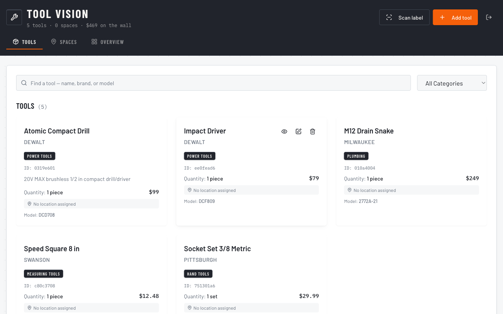
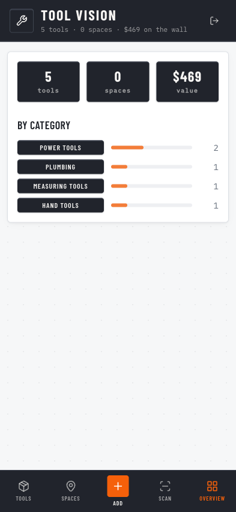

# Tool Vision Inventory

A free, open-source web app for small home garages to inventory their tools, using AI to map a photo of a physical storage space into a grid of labeled slots and remember what lives in each one.

## Features

- **AI space mapping into labeled slots** - Take a photo of a pegboard, drawer, or shelf and let the vision model map it into a grid of labeled SLOTS, so the app remembers what is stored where.
- **Per-slot QR labels** - Generate a scannable QR label for each slot that deep-links back to its contents.
- **Customizable label templates** - Adjust the Brother label layout to fit your labeling workflow.
- **Any-Brother-printer aim** - Templates are designed to print on common Brother label printers.
- **AI tool identification** - Point the vision model at a tool to help identify what it is when adding it to inventory.
- **Rapid Mode (hands-free labeling)** - Open a bin, present tools to the webcam one at a time, and label the whole bin by voice — no typing. Speech is transcribed locally by whisper.cpp on the desktop connector. See [docs/RAPID-MODE.md](docs/RAPID-MODE.md).
- **Find Mode (voice search)** - Ask "where's my chalk line" and it tells you (and highlights) the bin.
- **Durable print queue** - Labels that can't print (printer asleep) are queued and retried automatically, so a batch is never silently short a label.
- **Installable (PWA)** - Add the station to a home screen; the app shell works offline.
- **Accounts and per-user data** - Sign in and keep your inventory private to your own account.

## Screenshots

| Tools (desktop) | Overview (mobile) |
| --- | --- |
|  |  |

## Tech stack

- **Frontend:** React 18, Vite, TypeScript, shadcn/ui, Tailwind CSS
- **Backend / data:** Supabase (Postgres, Auth, Row Level Security)
- **Vision:** Cloudflare Worker (`vision-service/`) that prefers a self-hosted open-source model (any OpenAI-compatible endpoint, e.g. LiteLLM in front of Ollama running Qwen2.5-VL — set the `SELF_VISION_BASE`/`SELF_VISION_KEY` secrets) and falls back to free models via OpenRouter
- **Labels:** QR codes generated client-side, formatted for Brother label printers

## Quickstart

```sh
# 1. Clone the repository
git clone https://github.com/zohebzma2-cmyk/tool-vision-inventory.git
cd tool-vision-inventory

# 2. Install dependencies
npm install

# 3. Configure environment variables
cp .env.example .env
# Then edit .env and fill in:
#   VITE_SUPABASE_URL       - your Supabase project URL
#   VITE_SUPABASE_ANON_KEY  - your Supabase anon/public key
#   VITE_VISION_API_URL     - URL of your deployed vision service
```

Apply the database schema by running the SQL migrations in `supabase/migrations/` against your Supabase project (in order), using the Supabase SQL editor or the Supabase CLI.

```sh
# 4. Start the dev server
npm run dev
```

## Deployment

- **Frontend:** Deploy the built app to Cloudflare Pages.
- **Database:** Host Postgres, Auth, and RLS on the Supabase free tier. Apply the migrations in `supabase/migrations/`.
- **Vision:** Deploy the Cloudflare Worker in `vision-service/`, which calls open-source vision models via OpenRouter (free models by default). Alternatively, self-host the model with Ollama on a Mac mini using `scripts/setup-mac-mini.sh`.

## Self-hosting the vision model

If you would rather run the vision model yourself instead of using OpenRouter, see [`vision-service/README.md`](vision-service/README.md) for setup instructions, including the self-hosted Ollama path via `scripts/setup-mac-mini.sh`.

## Security

Data is protected with per-user Row Level Security (RLS) in Supabase, and an account is required to use the app. Each user can only read and write their own inventory data.

## Contributing

Contributions are welcome. Please read [CONTRIBUTING.md](CONTRIBUTING.md) before opening a pull request.

## License

Released under the [MIT License](LICENSE). Copyright (c) 2026 Zoheb Alvi.
